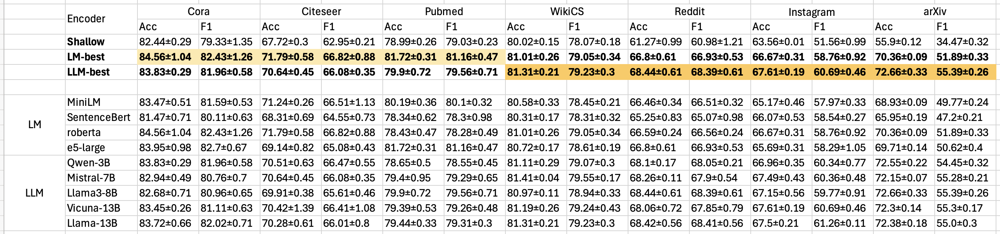
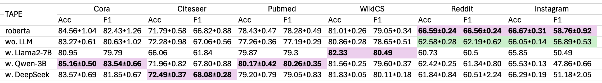

# LLM as Enhancers 

## LLM for Embedding Generation 

Relevant files are `embedding.py` and `main.py`:

* **`embedding.py`** This file utilizes various LMs and LLMs to generate node embeddings, saving the results in the `/datasets/` folder.

* **`main.py`** This file runs GNNs on a specified dataset for node classification tasks, allowing you to evaluate performance. You can specify the node encoder, which can be either an LM or an LLM.

### Example Scripts 

Please refer to `run.sh` for example commands:

```bash
# Generate Embedding 
#  - Specify dataset's name (`dataset`), encoder's name (`encoder_name`), and pooling method (`use_cls`)
#  - For LLMs, please remember to set `use_cls=0`
python3 embedding.py --encoder_name=e5-large --dataset=cora 
python3 embedding.py --encoder_name=Qwen-3B --dataset=cora  --use_cls=0


# Run GNNs 
# Note that the default encoder is Shallow Embedding, e.g.,
python3 main.py --dataset=cora 
# To use the generated node embeddings from a specified encoder, run:
# Ensure that you have executed `embedding.py` before this command.
python3 main.py --dataset=cora --encoder_name=e5-large 
# Additional GNN configurations
python3 main.py --dataset=cora --encoder_name=e5-large --gnn_type=GCN --n_layers=2 --hidden_dim=128 --dropout=0.5
```


### Performance and Observations 



* Shallow embeddings are relatively weak to represent the semantics of nodes, compared with either LM or LLM embeddings. 
> For Reddit and Instagram, we adopt the 300-dimensional vectors generated by [Node2Vec](https://github.com/eliorc/node2vec) as shallow embeddings. 

* For networks which exhibit **higher homogeneity** (i.e., Cora, Citeseer, and Pubmed), LM-generated embeddings are expressive enough to enhance downstream predictions compared to LLMs. 

|               | Cora   | Citeseer | Pubmed | WikiCS | Reddit | Instagram | arXiv  |
| ------------- | ------ | -------- | ------ | ------ | ------ | --------- | ------ |
| **Homophily** | 82.52% | 72.93%   | 79.24% | 68.67% | 55.53% | 65.35%    | 63.53% |

* LLMs are more powerful on **text-discriminative** datasets, like arXiv and WikiCS, which contains 40 and 10 categories, respectively, demanding more discriminative embeddings. 

|            | Cora | Citeseer | Pubmed | WikiCS | Reddit | Instagram | arXiv  |
| ---------- | ---- | -------- | ------ | ------ | ------ | --------- | ------ |
| **Labels** | 7    | 6        | 3      | **10** | 2      | 2         | **40** |


## TAPE (LLMs for Reasoning Text Generation)

We have refactored the official implementation of TAPE under the `TAPE` folder. The main files are:
```
.
├── config.py               --> Model configurations
├── explanation_api.py      --> Prompt closed-sourced LLMs (e.g., DeepSeek-Chat) to generate reasoning texts
├── explanation_qwen.py     --> Prompt open-sourced LLMs (e.g., Qwen2.5-series) to generate reasoning texts
├── gnn_trainer.py          --> Code for training GNNs for node classification
├── lm_trainer.py           --> Code for training LMs for text classification
├── trainEnsemble.py        --> Training multiple GNNs (with original text and generated text) and then ensembling to obtain final results
├── trainGNN.py             --> Training a single GNN
└── trainLM.py              --> Training an LM
```

During the experiments, we consider the following variants to investigate the effectiveness of LLMs:

* TAPE wo. LLM: this degrades to a two stage $\text{LM} \rightarrow \text{GNN}$ architecture. Using the <node, label> training pairs, the LM is first fine-tuned for text classification, followed by training the GNNs for node classification.

* TAPE w. LLM: this variant corresonds to the original TAPE architecture: $\text{LLM} \rightarrow \text{LM} \rightarrow \text{GNN}$. The main difference is that we replace GPT-3.5-turbo with different LLMs, including both closed-sourced DeepSeek-Chat and open-sourced Qwen2.5-3B. Additionally, we use results from GLBench with Llama2-7B. In this setup, the LLM generates reasoning texts for each node based on the classification task. The LM is then fine-tuned with both original and generated texts. Finally, multiple GNNs are ensembled using the generated text embeddings and original text embeddings as the initial node feature matrix to obtain predictions.


### Example Scripts 

Please refer to `run_TAPE.sh` for commands of different variants:

For the TAPE wo. LLM, the comands are as follows (first fine-tune an LM and then train GNN): 
```shell
for DATASET in cora citeseer pubmed wikics instagram reddit ; do 
    WANDB_DISABLED=True TOKENIZERS_PARALLELISM=False  python -m trainLM dataset $DATASET runs 3  
    python -m trainGNN dataset $DATASET runs 5 
done 
```

To use an LLM, first prompt it to prepare the reasoning texts (using Qwen2.5-3B as an example):
```shell 
for DATASET in cora citeseer pubmed wikics instagram reddit  ; do 
    python3 -u explanation_qwen.py --dataset=$DATASET
done 
```

With the generated texts ready, you can run the TAPE framework: 
```shell 
for LLM in Qwen2.5-3B  ; do 
    for DATASET in cora citeseer ; do  
         WANDB_DISABLED=True TOKENIZERS_PARALLELISM=False  python -m trainLM dataset $DATASET runs 3  lm.train.use_gpt True   lm.train.llm_name $LLM 
         python -m trainEnsemble dataset $DATASET runs 5 gnn.train.feature_type TA_E lm.train.llm_name $LLM   
    done 
done 
```


### Performance and Observations 



* LLMs acting as reasoners are beneficial for text-rich labels, as they can leverage their inherent reasoning abilities to introduce **external knowledge**, which exceeds the capabilities of GNNs or LMs. For example, with Qwen2.5-3B, the Accuracy on Cora can achieve 85.16%. 
* For structure-related labels, LLMs' **unreliable or biased predictions** may degrade performance when the reasoning texts are noisy or inaccurate. For example, labels of Reddit are strongly correlated with structural features, which LLMs fail to understand, leading to performance drop.

> Following Degree MSE measures the MSE values between pairs of avg degree of categories. For Reddit, it contains two categories, i.e., normal users and popular users, with average degrees of 12.40 and 23.83, respectively.

|                | Cora  | Citeseer | Pubmed | WikiCS | Reddit   | Instagram | arXiv |
| -------------- | ----- | -------- | ------ | ------ | -------- | --------- | ----- |
| **Degree MSE** | 0.020 | 0.068    | 0.023  | 0.153  | **0.23** | 0.007     | 0.064 |

