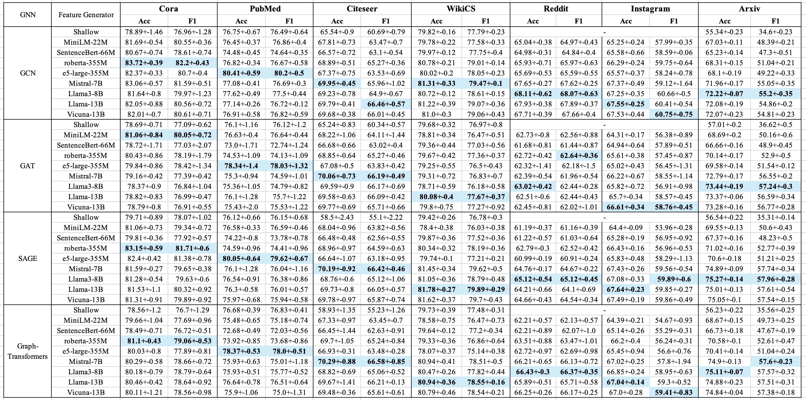
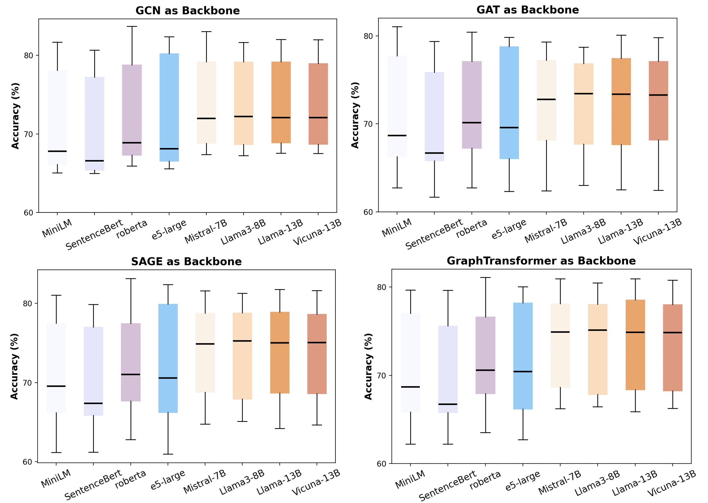
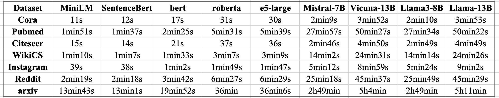
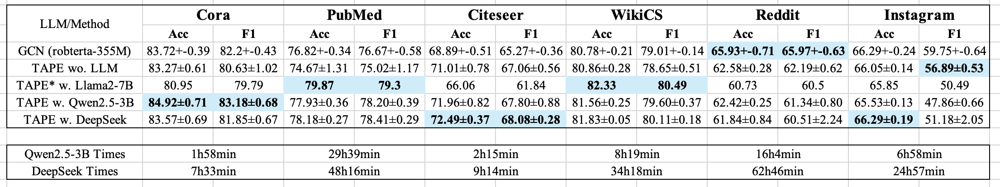

# (tentative) How Much Have We Achieved? Revisiting and Benchmarking on LLMs for Graph Tasks.

This is our ongoing project to explore the effectiveness of Large Language Models (LLMs) for graph tasks using two popular approaches:

* **LLM as Encoder**: Utilize LLMs' text representation capabilities to generate node embeddings. Compare these with embeddings from smaller language models and shallow methods.
* **LLM as Predictor**: Harness LLMs' reasoning abilities to directly predict node labels. Evaluate this in both supervised and zero-shot scenarios.

In terms of implementation and engineering, unlike existing LLM+Graph benchmarks (e.g., [GLBench](https://github.com/NineAbyss/GLBench)) that merely collect code repositories without unified integration, we will develop **a comprehensive sandbox** where other researchers can easily invoke LM/LLM/GNN/LLM+GNN pipelines and observe results seamlessly.


## Work in Progress 

### **RQ1 How Effective Are LLMs as Enhancers?**

- [x] GNN as Backbones - investigate the effectiveness of LLM's generated embeddings, compare it with small-scale LMs and shallow embedding

  * **Performance** LLMs generate higher-quality text representations compared to LMs, as shown by improved results in downstream task, i.e., node classification. This is especially evident in datasets such as arXiv, which includes 40 categories and demands highly discriminative node representations.
  * **Efficiency** Although LLMs improve performance in textual representation learning, they require extensive encoding time. For example, encoding arXiv data with LLMs (13B parameters) takes over **5 hours**. Additionally, LLMs necessitate a high embedding dimension (4096 or 5120), whereas LMs can reduce memory usage significantly with dimensions of 768 or 1024.

 




- [x] TAPE Implementation and Experiments
  * The TA version of TAPE, which uses only each node's original text followed by a decoupled LM+GNN architecture, has completed experiments.
  * The full version of TAPE requires an LLM to generate reasoning explanations for each node in text format, which is quite **resource-intensive**. We are currently conducting experiments to investigate: i) **whether performance is significantly influenced by the capabilities of the LLMs** (e.g., the original TAPE paper relies on GPT-3.5-turbo), and ii) **the effectiveness-cost balance of using LLMs as text generators**





- [ ] ZeroG Implementation and Experiments


### **RQ2 How Effective Are LLMs as Predictors?**

We investigate this research question under both zero-shot and supervised scenarios 

#### Zero-shot Setting

- [ ] LLMs Direct Inference
- [ ] LLMs Direct Inference w. Structural Information 


## Dataset & Setup

- **Environment Setup**: Check out `requirements.txt` for dependencies.
- **Datasets**: Download the processed datasets from [this link](https://drive.google.com/drive/folders/1WfBIPA3dMd8qQZ6QlQRg9MIFGMwnPdFj) and place them in the `datasets` folder.


## LLM as Encoder 

- `data_demo.py`: A demo file to get acquainted with the `torch_geometric.data.Data` class.
- `embedding.py`: Generate node embeddings using specified Language Models (LM) or Large Language Models (LLM) of various sizes.
  | Type | Name              | Scale |
  | ---- | ----------------- | ----- |
  | LM   | Mini-LM           | 22M   |
  | LM   | SentenceBert      | 66M   |
  | LM   | e5-Large, Roberta | 355M  |
  | LLM  | Mistral-7B        | 7B    |
  | LLM  | Llama3-8B         | 8B    |
  | LLM  | Vicuna-13B        | 13B   |
  | LLM  | Llama2-13B        | 13B   |


- `main.py`: Perform node classification on experimental datasets using either (L)LM-generated embeddings or initial shallow embeddings.
- `gnn.py`: Implements GNN with variants including GCN, GIN, GAT, GraphTransformer, and GraphSAGE.

Example scripts for running code on the `cora` dataset:

```bash
# Generate node embeddings using the e5-large model on a CUDA environment 
# (approximately 30 seconds on a single GPU with 48GB)
python embedding.py --encoder_type=LM --lm_name=e5-large 

# Generate node embeddings using the e5-large model on a CPU 
# (approximately 4 minutes on a 16GB MacBook Air)
python embedding.py --device=cpu --encoder_type=LM --lm_name=e5-large

# Generate node embeddings using Llama3-8B on a CUDA environment 
# (for LLMs, set use_cls to 0; approximately 2 minutes on a single GPU with 48GB)
python embedding.py --encoder_type=LLM --llm_name=Llama3-8B --use_cls=0 

# Run GNNs with shallow embeddings on CPU
python main.py --device=cpu 

# Run GNNs with e5-large generated embeddings on CPU
python main.py --device=cpu --emb_type=LM --emb_model=e5-large --gnn_type=GCN 
```

Feel free to explore, experiment, and contribute! 🚀
